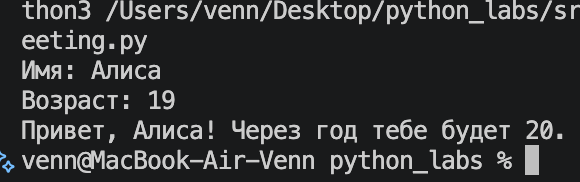
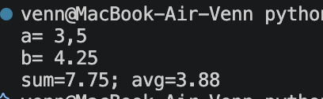
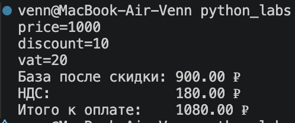
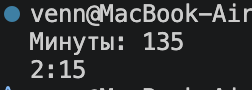
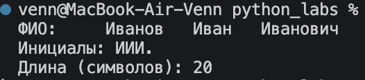

### Лабораторная работа 1

#### Задание 1

```python
name = input('Имя: ')
age = int(input('Возраст: '))
print(f'Привет, {name}! Через год тебе будет {age+1}.')
```



#### Задание 2

```python
a = float(input('a= ').replace(',', '.'))
b = float(input('b= ').replace(',', '.'))
sum1 = a + b
avg1 = (a + b) / 2
print(f'sum={sum1:.2f}; avg={avg1:.2f}')
```



#### Задание 3

```python
price = float(input('price='))
discount = float(input('discount='))
vat = float(input('vat='))
base = price * (1 - discount/100)
vat_amount = base * (vat/100)
total = base + vat_amount
print(f'База после скидки: {base:.2f} ₽')
print(f'НДС:               {vat_amount:.2f} ₽')
print(f'Итого к оплате:    {total:.2f} ₽')
```



#### Задание 4

```python
m = int(input ("Минуты: "))
hours = m // 60
minutes = m % 60
print (f"{hours}:{minutes:02d}")
```



#### Задание 5

```python
fio = input('ФИО: ')
a = fio.split()
init = a[0][0] + a[1][0] + a[2][0]
print(f'Инициалы: {init.upper()}.')
print(f'Длина (символов): {len(' '.join(a))}')
```


