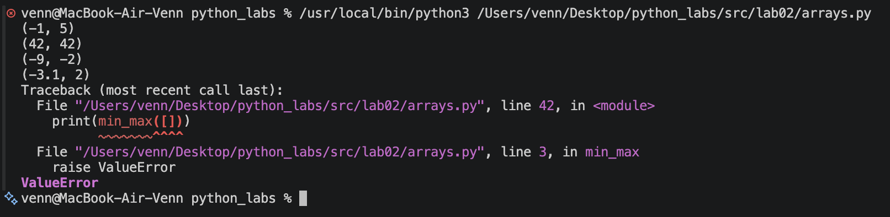
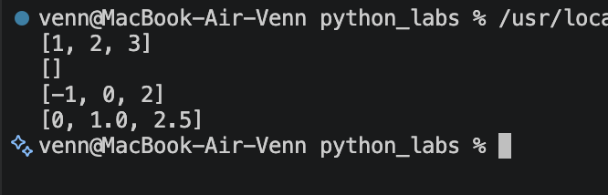
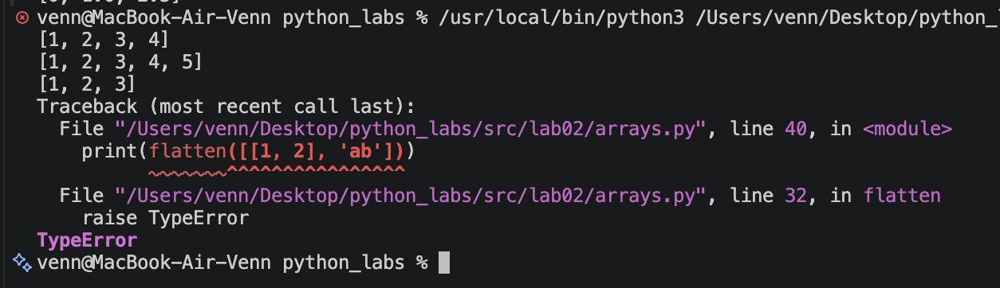
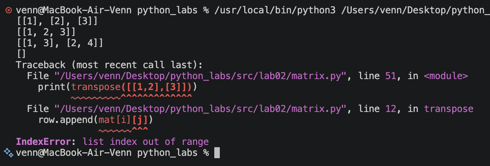
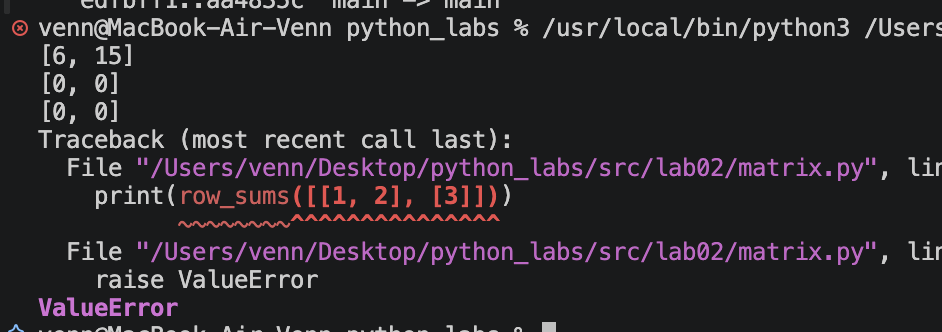
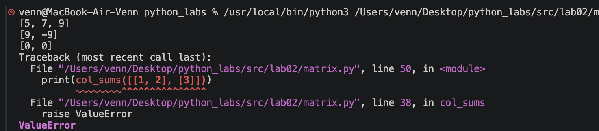
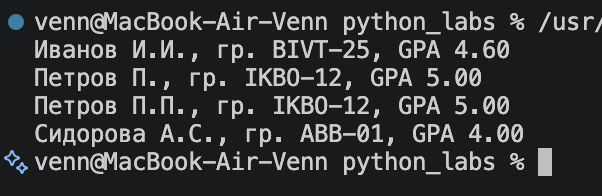

### Лабораторная работа 2

#### Задание 1
  

```python
def min_max(nums: list[float | int]) -> tuple[float | int, float | int]:
    """
    Находит минимальное и максимальное число в списке.
    Если список пустой, вызывает ValueError.
    """
    if len(nums) == 0:
        raise ValueError
    min = nums[0]
    max = nums[0]
    for x in nums:
        if x < min:
            min = x
        if x > max:
            max = x
    return min, max


def unique_sorted(nums: list[float | int]) -> list[float | int]:
    """
    Убирает повторяющиеся числа и сортирует их по возрастанию.
    """
    unique = []
    for x in nums:
        if x not in unique:
            unique.append(x)
    for i in range(len(unique)):
        for j in range(i + 1, len(unique)):
            if unique[j] < unique[i]:
                unique[i], unique[j] = unique[j], unique[i]
    return unique


def flatten(mat: list[list | tuple]) -> list:
    """
    Объединяет списки и кортежи в один список.
    Если элемент не список и не кортеж, вызывает TypeError.
    """
    result = []
    for row in mat:
        if not isinstance(row, (list, tuple)):
            raise TypeError
        for x in row:
            result.append(x)
    return result
```





#### Задание 2

```python
def transpose(mat: list[list[float | int]]) -> list[list]:
    """
    Меняет строки и столбцы матрицы местами.
    Если матрица рваная, вызывает ValueError.
    """
    if mat == []:
        return []
    length = len(mat[0])
    for row in mat:
        if len(row) != length:
            raise ValueError
    result = []
    for j in range(length):
        row = []
        for i in range(len(mat)):
            row.append(mat[i][j])
        result.append(row)
    return result


def row_sums(mat: list[list[float | int]]) -> list[float]:
    """
    Считает сумму чисел в каждой строке матрицы.
    Если матрица рваная, вызывает ValueError.
    """
    if mat == []:
        return []
    length = len(mat[0])
    for row in mat:
        if len(row) != length:
            raise ValueError
    result = []
    for row in mat:
        total = 0
        for x in row:
            total += x
        result.append(total)
    return result


def col_sums(mat: list[list[float | int]]) -> list[float]:
    """
    Считает сумму чисел в каждом столбце матрицы.
    Если матрица рваная, вызывает ValueError.
    """
    if mat == []:
        return []
    length = len(mat[0])
    for row in mat:
        if len(row) != length:
            raise ValueError
    result = []
    for j in range(length):
        total = 0
        for i in range(len(mat)):
            total += mat[i][j]
        result.append(total)
    return result
```





#### Задание 3

```python
def format_record(rec: tuple[str, str, float]) -> str:
    """
    Убирает лишние пробелы, формирует инициалы и выводит GPA с двумя знаками после точки.
    При некорректных данных вызывает ошибку.
    """
    fio = rec[0]
    group = rec[1]
    gpa = rec[2]
    if not isinstance(fio, str):
        raise TypeError
    if not isinstance(group, str):
        raise TypeError
    if not isinstance(gpa, (int, float)):
        raise TypeError
    fio = ' '.join(fio.split())
    group = group.strip()
    if fio == '':
        raise ValueError
    if group == '':
        raise ValueError
    if gpa < 0 or gpa > 5:
        raise ValueError
    words = fio.split()
    surname = words[0]
    if len(words) < 2:
        raise ValueError
    init = words[1][0].upper() + '.'
    if len(words) >= 3:
        init += words[2][0].upper() + '.'
    surname = surname[0].upper() + surname[1:].lower()
    return f'{surname} {init}, гр. {group}, GPA {gpa:.2f}'
```




